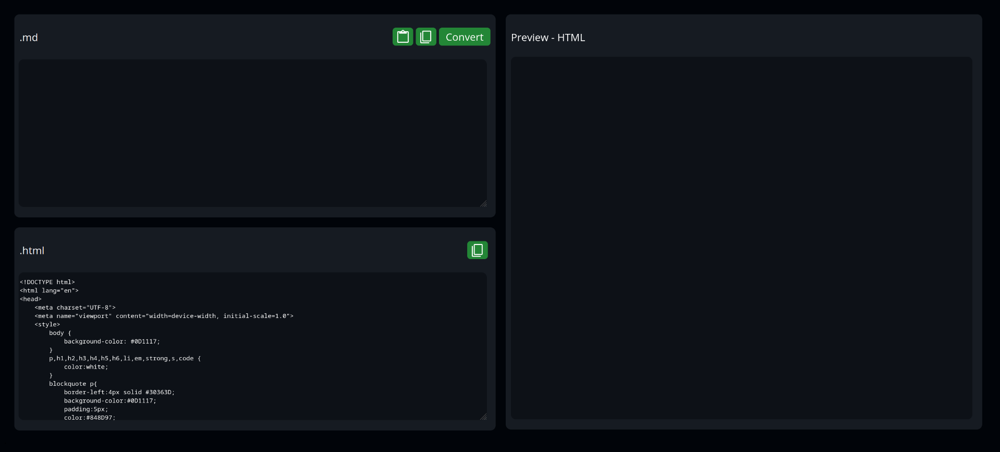
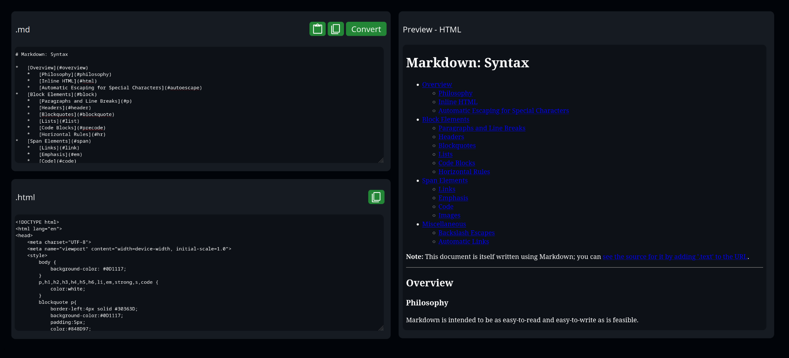
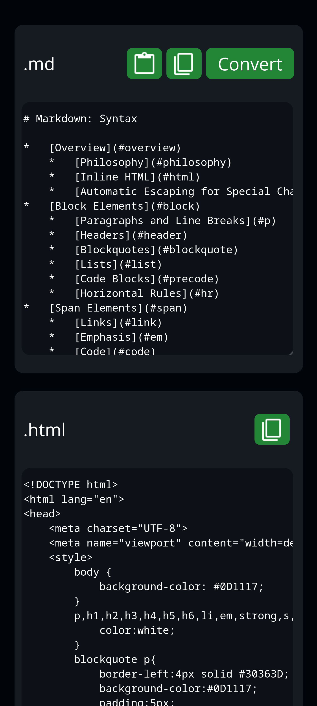
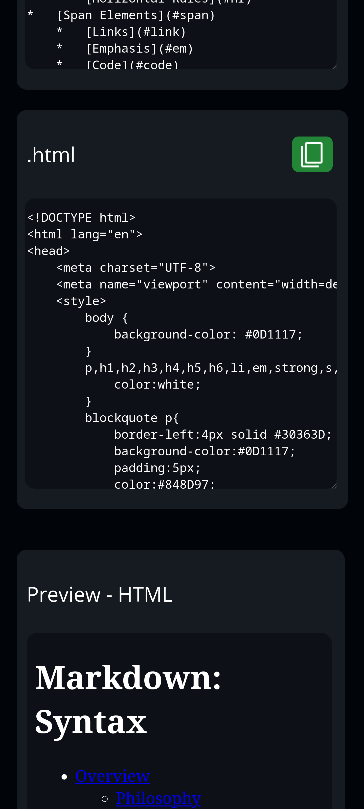

## Convert Github flavored markdown into HTML code 

Initially, I believed I needed to construct the parser and compiler entirely from the ground up. Within just two days, I managed to accomplish around 95% of this task. However, progress I got stuck when I tried handling nested lists, which consumed more than a week of effort to achieve partial functionality.

It wasn't until I noticed the presence of marked.js in the reference materials that I realized i could use a library. Utilizing marked.js made it way easier, thus completing the project.

Despite the challenge, I will work on refining the handling of nested lists as a personal challenge. Building this website has been an satisfying experience, and I would love to continue improving it.

Link to deployed website : [Markdown Previewer](https://vishnutejase.github.io/MarkdownPreviewer/)

## Screenshots 
- ### Desktop

- ### Mobile
 

## Miscellaneous
Link to repository with my implementation of markdown parser and compiler : [Markdown Previewer](https://github.com/vishnutejase/mdPreviewer)
